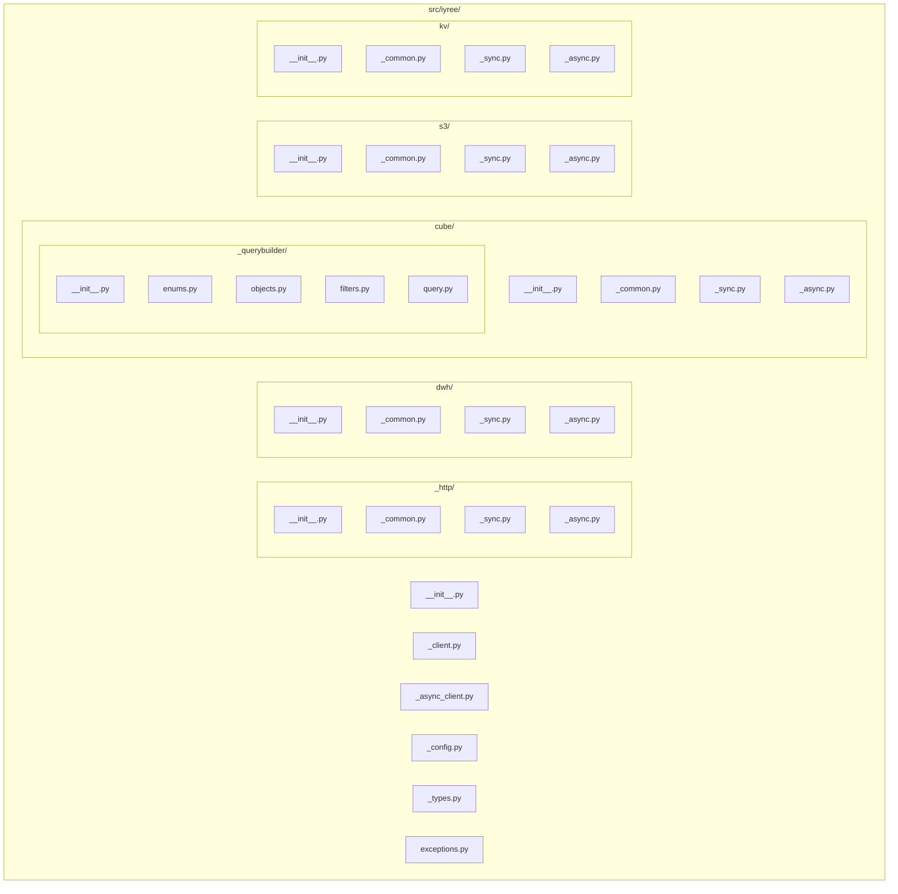

# IYREE Python SDK Implementation Plan

## Current State

The workspace contains only:

- `pyproject.toml` -- Poetry-only stub (name/version/description/authors), no dependencies or build system
- `iyree/cube/_querybuilder/` -- 4 files (enums, objects, filters, query) with working serialization logic
- No `src/` layout, no `__init__.py` for `iyree/` or `iyree/cube/`, no HTTP layer, no clients, no tests

## Structural Migration: Flat to src/ Layout

Move from `iyree/` to `src/iyree/` to match the spec's src layout. The existing query builder files relocate to `src/iyree/cube/_querybuilder/`. All new files are created under `src/iyree/`.

## Phase 1: Project Scaffolding and Foundation

### 1.1 Restructure to src/ layout

- Create `src/iyree/` directory tree
- Move existing `iyree/cube/_querybuilder/*.py` files to `src/iyree/cube/_querybuilder/`
- Delete old `iyree/` directory

### 1.2 Rewrite pyproject.toml

Replace the Poetry stub with the full hatchling-based config from spec Section 15. Key points:

- Build backend: `hatchling`
- `requires-python = ">=3.9"`
- Dependencies: `httpx>=0.24`, `tenacity>=8.0`
- Optional extras: `pandas` (`pandas>=1.5`), `dev` (pytest, pytest-asyncio, respx, pandas)
- `[tool.hatch.build.targets.wheel] packages = ["src/iyree"]`
- `[tool.pytest.ini_options] asyncio_mode = "auto"`

### 1.3 exceptions.py (Section 11)

Create `src/iyree/exceptions.py` with the full hierarchy. Base `IyreeError` carries `message`, `status_code`, `response_body`. `IyreeConfigError` is the exception that does NOT carry HTTP fields. `IyreeDuplicateLabelError` subclasses `IyreeStreamLoadError`.

### 1.4 _config.py (Section 5.1)

Create `src/iyree/_config.py` with the frozen `IyreeConfig` dataclass. Include a factory/validator that:

- Raises `ValueError` if `api_key` is empty/None
- Falls back to `IYREE_GATEWAY_HOST` env var if `gateway_host` not provided
- Raises `IyreeConfigError` if neither source provides a gateway host
- Normalizes: strips trailing `/`, validates `http://` or `https://` prefix

### 1.5 _types.py (Section 8.1, 7.3, 9, 10)

Create `src/iyree/_types.py` with all result dataclasses:

- `ColumnMeta`, `DwhQueryResult` (with `to_dicts()`, `to_dataframe()`)
- `StreamLoadResult`
- `CubeQueryResult` (with `to_dataframe()`)
- `S3Object`, `S3ListResult`, `S3CopyResult`, `S3DeleteResult`, `S3DeleteError`, `PresignedUrlInfo`
- `KvDocument`

For `to_dataframe()` methods, use lazy `import pandas` with a clear `ImportError` message suggesting `pip install iyree[pandas]`.

## Phase 2: HTTP Transport Layer (Section 6)

### 2.1 _http/_common.py

Pure functions, zero httpx imports:

- `should_retry(status_code)` -- True for 429, 502, 503, 504
- `is_client_error(status_code)` -- True for 400, 401, 403, 404, 409, 422
- `map_status_to_exception(status_code, response_body, response)` -- maps to correct exception class
- `build_auth_headers(api_key)` -- returns `{"x-api-key": api_key}`
- `get_retry_after(headers)` -- parses `Retry-After` header

### 2.2 _http/_sync.py -- HttpTransport

Wraps `httpx.Client`. Two methods:

- `request()` -- injects `x-api-key`, applies tenacity retry (exponential backoff 0.5s start, multiplier 2, max 10s, jitter). Retries on `httpx.TransportError` and status codes from `should_retry()`. After retries exhausted, calls `map_status_to_exception()`.
- `request_presigned()` -- NO `x-api-key`, own retry policy (transport errors + 5xx only).
- `close()` -- closes the underlying `httpx.Client`.

Retry implementation: use tenacity `@retry` decorator on an inner method, or use `Retrying` context manager. Honor `Retry-After` header for 429s.

### 2.3 _http/_async.py -- AsyncHttpTransport

Mirror of `_sync.py` but with `httpx.AsyncClient`, `async def`, and `await`. Tenacity works natively with async functions.

### 2.4 _http/**init**.py

Re-exports `HttpTransport` and `AsyncHttpTransport`.

## Phase 3: Fix and Finalize Query Builder

### 3.1 Fix existing issues in _querybuilder

- `objects.py` line 3: `__ALL`__ --> `__all`__ (Python convention)
- `filters.py` line 8: `__ALL`__ --> `__all_`_
- `filters.py` `Filter.serialize()` line 138: guard against `self.values is None` for `set`/`notSet` operators -- omit `values` key when None
- `filters.py` lines 30-31, 75: replace `assert` with `ValueError` (assertions are stripped by `-O`)
- Add `from __future__ import annotations` to all query builder files for Python 3.9 compat

### 3.2 _querybuilder/**init**.py

Populate with actual re-exports: `Cube`, `Measure`, `Dimension`, `Segment`, `Query`, `DateRange`, `TimeDimension`, `Filter`, `Or`, `And`, `TimeGranularity`, `Order`, `FilterOperator`.

## Phase 4: DWH Client (Section 8)

### 4.1 dwh/_common.py

Pure helper functions:

- `build_sql_request_body(query, session_variables)` -- builds `{"query": ..., "sessionVariables": ...}`
- `parse_ndjson_lines(lines)` -- iterates parsed JSON objects, extracts connectionId, meta, data rows, statistics; returns `DwhQueryResult`
- `prepare_stream_load_headers(table, format, label, columns, column_separator, **extra)` -- builds the full header dict
- `dataframe_to_csv_bytes(df)` -- `df.to_csv(index=False, header=False)`, returns `(bytes, column_names)`
- `prepare_insert_data(data, format, columns)` -- handles str/bytes/DataFrame/list[dict] dispatch
- `parse_stream_load_response(data)` -- builds `StreamLoadResult`
- `validate_stream_load_status(result)` -- raises `IyreeStreamLoadError` / `IyreeDuplicateLabelError`

### 4.2 dwh/_sync.py -- DwhClient

- `sql()` -- streams NDJSON via `response.iter_lines()`, collects lines, calls `parse_ndjson_lines()`
- `insert()` -- prepares data/headers via common helpers, sends PUT with `stream_load_timeout`, validates response

### 4.3 dwh/_async.py -- AsyncDwhClient

Mirror of sync but with `async for line in response.aiter_lines()` for streaming.

### 4.4 dwh/**init**.py

Re-exports `DwhClient`, `AsyncDwhClient`.

## Phase 5: Cube Client (Section 7)

### 5.1 cube/_common.py

Pure helper functions:

- `parse_jwt_expiry(token)` -- base64url-decode middle segment, extract `exp`. NO PyJWT dependency.
- `is_token_expired(expiry, buffer_seconds=60)` -- compares against `time.time()`
- `is_continue_wait_response(data)` -- checks `data.get("error") == "Continue wait"`
- `build_load_params(query)` -- if `Query`, call `.serialize()`; if dict, use directly. URL-encode.
- `compute_continue_wait_delay(attempt)` -- 0.5, 1.0, 2.0, 2.0, ...
- `should_set_multi_query_type(query)` -- checks if any `time_dimensions` has `compare_date_range`
- `parse_load_response(data)` -- builds `CubeQueryResult`

### 5.2 cube/_sync.py -- CubeClient

- Token management: `_ensure_token()` fetches/caches JWT, checks expiry with 60s buffer
- `load(query)` -- builds params, enters continue-wait polling loop (separate from tenacity retry), handles 401/403 token invalidation + single retry
- `meta()` -- fetches cube metadata with token auth

### 5.3 cube/_async.py -- AsyncCubeClient

Mirror of sync but with `asyncio.Lock` for token refresh to prevent concurrent races. The continue-wait loop uses `await asyncio.sleep(delay)`.

### 5.4 cube/**init**.py

Re-exports `CubeClient`, `AsyncCubeClient`, and all query builder types.

## Phase 6: S3 Client (Section 9)

### 6.1 s3/_common.py

- `build_list_params(prefix, max_keys, continuation_token)` -- query param dict
- `build_presigned_url_body(key, method, content_type)` -- POST body
- `parse_list_response(data)` -- builds `S3ListResult` with `S3Object` list
- `parse_copy_response(data)` / `parse_delete_response(data)`
- `prepare_upload_data(data)` -- handles bytes/str/BinaryIO

### 6.2 s3/_sync.py -- S3Client

- Management ops: `list_objects()`, `list_objects_iter()` (yields via `Iterator`), `copy_object()`, `delete_objects()`
- `_generate_presigned_url()` -- internal helper
- Data ops: `upload_object()`, `download_object()`, `download_object_to_file()` (streaming), `upload_dataframe()`
- All presigned URL calls use `self._http.request_presigned()` -- critical to NOT inject `x-api-key`

### 6.3 s3/_async.py -- AsyncS3Client

Mirror. `list_objects_iter()` returns `AsyncIterator[S3Object]` via `async def` generator.

### 6.4 s3/**init**.py

Re-exports.

## Phase 7: KV Client (Section 10)

### 7.1 kv/_common.py

- `build_put_body(data, key, indexes, ttl, upsert)` -- constructs POST body
- `build_patch_body(set_, unset, inc, indexes)` -- constructs PATCH body
- `parse_document(data)` -- builds `KvDocument` with datetime parsing

### 7.2 kv/_sync.py -- KvClient

Methods: `get()`, `put()`, `delete()`, `exists()` (returns bool, no raise on 404), `patch()`

### 7.3 kv/_async.py -- AsyncKvClient

Mirror.

### 7.4 kv/**init**.py

Re-exports.

## Phase 8: Top-Level Clients (Section 5)

### 8.1 _client.py -- IyreeClient (sync)

- Constructor validates `api_key`, resolves `gateway_host`, creates `IyreeConfig`, creates `HttpTransport`
- Lazy properties: `dwh`, `cube`, `s3`, `kv` -- instantiated on first access, share the transport
- Context manager: `__enter`_*/`__exit_`* calling `close()`

### 8.2 _async_client.py -- AsyncIyreeClient (async)

- Constructor is NOT async. Creates `httpx.AsyncClient` eagerly in `__init`__.
- Lazy properties for sub-clients
- `async def close()`, `__aenter`_*/`__aexit_`*

### 8.3 **init**.py (top-level public API, Section 12)

Re-exports all public symbols: both client classes, all exceptions, all result types, all query builder types.

## Phase 9: Sub-package **init**.py Files

Create `__init__.py` for each sub-package (`_http/`, `dwh/`, `cube/`, `s3/`, `kv/`) with appropriate re-exports.

## Phase 10: Tests (Section 14)

### Test infrastructure

- `tests/conftest.py` -- shared fixtures: mock IyreeConfig, respx router, sync/async client factories

### Test files

- `tests/test_http.py` -- retry logic, error mapping, `Retry-After` honoring, presigned URL no-auth
- `tests/test_dwh_sync.py` / `test_dwh_async.py` -- NDJSON streaming, Stream Load (with DataFrame, list[dict], CSV), label idempotency, error cases
- `tests/test_cube_sync.py` / `test_cube_async.py` -- continue-wait polling, token refresh on 401, token expiry, Query and dict input
- `tests/test_s3_sync.py` / `test_s3_async.py` -- presigned URL two-step flow, pagination iterator, upload/download, no x-api-key on S3 calls
- `tests/test_kv_sync.py` / `test_kv_async.py` -- CRUD operations, `exists()` 404 behavior
- `tests/test_querybuilder.py` -- `serialize()` for Query, Filter, TimeDimension, DateRange, Or/And

## Phase 11: README.md

Usage examples for sync and async patterns, installation instructions, all four sub-clients.

## Key Architectural Decisions

- **_common.py invariant**: Every `_common.py` has ZERO httpx imports. This is the foundation for code sharing.
- **No wrapper pattern**: Sync and async are independent implementations sharing common logic. No `asyncio.run()` in sync, no `run_in_executor()` in async.
- **Tenacity for transport retries, manual loop for Cube continue-wait**: These are distinct mechanisms that can be active simultaneously.
- **Stream Load retry safety**: Only retry when `label` is provided (idempotent) or on 429/503 (request not processed).
- **Logging**: Use `logging.getLogger("iyree")` throughout. DEBUG for request/response, WARNING for retries, ERROR for exhausted retries. Never log the API key.

